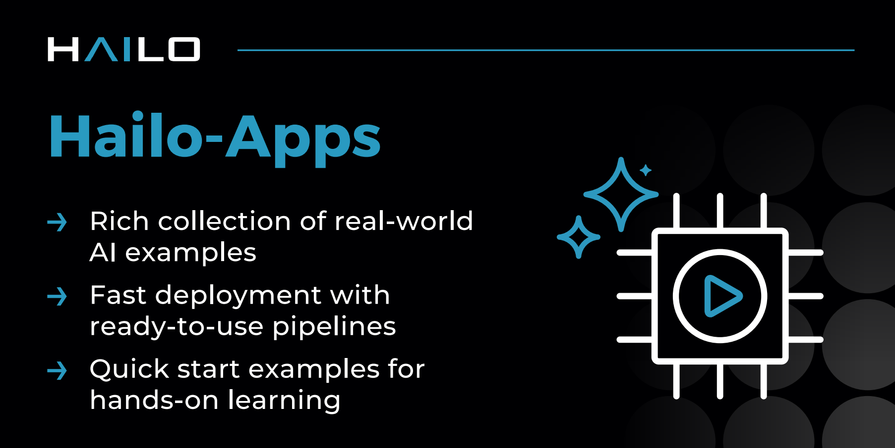

# Hailo-Apps

High performance AI applications for Hailo accelerators, including GStreamer pipelines, GenAI assistants, and standalone C++/Python apps.

[](https://deepwiki.com/hailo-ai/hailo-apps)

## Supported Platforms and Devices

| Platforms                                                                                                                                                                                                                                                                           | Accelerators                                                                                                                                                                                                                  |
| ----------------------------------------------------------------------------------------------------------------------------------------------------------------------------------------------------------------------------------------------------------------------------------- | ----------------------------------------------------------------------------------------------------------------------------------------------------------------------------------------------------------------------------- |
|    |    |

## AI-Powered Development (Beta)

Use AI coding agents to quickly create Hailo applications. Describe your idea and the agent builds, validates, and runs it for you.

Supports VLM, LLM, pipeline, and standalone app types across all Hailo accelerators.

**[Get started →](./doc/user_guide/agentic_development.md)**

🎮 Try out our [Easter Eggs game](hailo_apps/python/pipeline_apps/easter_game/), built autonomously by AI.


## Applications

30+ ready-to-run applications:

| Type                | Best For                                      | Location                                                 |
| ------------------- | --------------------------------------------- | -------------------------------------------------------- |
| **GenAI Apps**      | LLM/VLM/speech workflows on Hailo-10H         | `hailo_apps/python/gen_ai_apps/`                         |
| **Pipeline Apps**   | Real-time camera/RTSP/video processing        | `hailo_apps/python/pipeline_apps/`                       |
| **Standalone Apps** | HailoRT learning and minimal per-app installs | `hailo_apps/python/standalone_apps/` + `hailo_apps/cpp/` |

[All Applications](./doc/user_guide/running_applications.md)

### New in v26.03.0

Windows support, YOLO26 models, Voice2Action demo, AI-powered agentic development, and more.

[Full changelog →](./changelog.md)

## Installation

Hailo Apps supports different installation methods depending on the platform and application type:

* **Shared Hailo Apps installation** for GStreamer pipeline apps and shared Python/GenAI environments
* **Per-app Python installation** for standalone Python and GenAI apps
* **C++ app installation** for standalone C++ apps

GStreamer pipeline apps are only supported by the shared Hailo Apps installation.

For platform prerequisites and complete installation instructions, see:

**[Hailo-Apps Installation Guide →](./doc/user_guide/installation.md)**

## Quick Start

After completing the [installation guide](./doc/user_guide/installation.md), load the Hailo Apps environment:

```bash
source setup_env.sh
```

Run one of the pipeline apps:

```bash
hailo-detect-simple
hailo-pose
hailo-seg
hailo-depth
hailo-tiling
```

| Detection                                         | Pose Estimation                                         | Instance Segmentation                                         | Depth Estimation                              |
| ------------------------------------------------- | ------------------------------------------------------- | ------------------------------------------------------------- | --------------------------------------------- |
|  |  |  |  |

## Documentation

**[📖 Complete Documentation](./doc/README.md)**

| Guide                                                      | What's Inside                                                  |
| ---------------------------------------------------------- | -------------------------------------------------------------- |
| **[Installation Guide](./doc/user_guide/installation.md)** | Platform prerequisites and installation options                |
| **[User Guide](./doc/user_guide/README.md)**               | Running apps, configuration, and repository structure          |
| **[Developer Guide](./doc/developer_guide/README.md)**     | Build custom apps, write post-processing, and model retraining |

## Support

💬 [Hailo Community Forum](https://community.hailo.ai/)

**License:** MIT - see [LICENSE](LICENSE)
