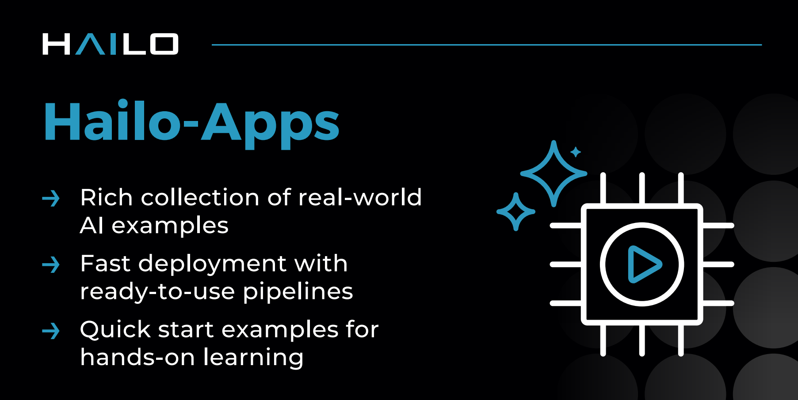

| **Supported Hosts** | **Accelerators** |
| --- | --- |
|    |    |

## Getting Started

> **Setup → [Installation Guide](./doc/user_guide/installation.md)**  
> Follow the setup for your platform, then explore the applications below.

### Application Types

Hailo Apps includes 30+ ready-to-run applications across three categories:

| Type | Best For | Location |
| --- | --- | --- |
| **GenAI Apps** | LLM, VLM, and speech applications on Hailo-10H | `hailo_apps/python/gen_ai_apps/` |
| **GStreamer Pipeline Apps** | Real-time camera, RTSP, and video processing | `hailo_apps/python/pipeline_apps/` |
| **Standalone Apps** | Minimal Python and C++ examples using HailoRT directly | `hailo_apps/python/standalone_apps/` · `hailo_apps/cpp/` |

### Try an App

A few example GStreamer pipeline applications:

<table>
<tr>
<td align="center"> <code>hailo-detect-simple</code></td>
<td align="center"> <code>hailo-pose</code></td>
<td align="center"> <code>hailo-seg</code></td>
<td align="center"> <code>hailo-depth</code></td>
</tr>
</table>

See **[Running Applications](./doc/user_guide/running_applications.md)** for the complete application list, supported inputs, and usage examples.

## AI-Powered Development (Beta)

Use AI coding agents to quickly create Hailo applications. Describe your idea and the agent builds, validates, and runs it for you.

Supports VLM, LLM, pipeline, and standalone app types across all Hailo accelerators.

**[Get started →](./doc/user_guide/agentic_development.md)**

## Documentation

**[Complete Documentation](./doc/README.md)** · **[User Guide](./doc/user_guide/README.md)**

| Guide | Use It For |
| --- | --- |
| **[Prerequisites](./doc/user_guide/prerequisites.md)** | Installing HailoRT and required platform components |
| **[Installation Guide](./doc/user_guide/installation.md)** | Choosing and completing the correct installation method |
| **[Running Applications](./doc/user_guide/running_applications.md)** | Running apps, input sources, and CLI options |
| **[Configuration](./doc/user_guide/configuration.md)** | Configuring application defaults |
| **[Developer Guide](./doc/developer_guide/README.md)** | Building custom GStreamer pipeline apps, post-processing, and model retraining |

### Ask DeepWiki

Use DeepWiki to explore the repository and ask questions about the codebase.

## Support

💬 [Hailo Community Forum](https://community.hailo.ai/)

## License

This project is licensed under the [MIT License](LICENSE).