# Drone Follow — Design Review

A comprehensive architecture reference for the hailo-drone-follow system.
For control algorithm details see [control-architecture.md](control-architecture.md).
For parameter bridge specifics see [PARAMETERS.md](../PARAMETERS.md).
For setup & deployment see [SETUP_GUIDE.md](../SETUP_GUIDE.md).

---

## 1. System Overview

A vision-based autonomous drone follow application. A Hailo NPU runs real-time
person detection (YOLO) on a camera stream; a control loop converts detections
into body-frame velocity commands sent to PX4 via MAVSDK. Runs on RPi5 +
Hailo-8L on a drone with Cube Orange+ flight controller, or on an x86 dev
machine with Hailo-8 PCIe.

**Key properties:**
- Single 4-DOF output primitive: body-frame velocity + yawrate (no attitude, no waypoints)
- Pure domain logic (`follow_api/`) has zero external dependencies — testable offline
- All Hailo/GStreamer code confined to `pipeline_adapter/`; all MAVSDK code confined to `drone_api/`
- Runtime-tunable via web UI (localhost:5001) and OpenHD ground station (MAVLink parameters)
- Optional OpenHD video streaming, on-board recording, PX4 SITL simulation

---

## 2. System Context Diagram

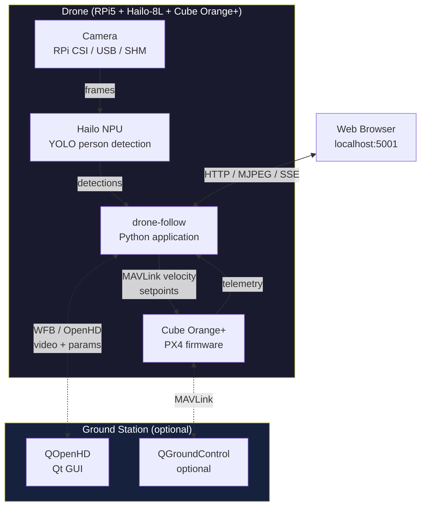

---

## 3. Software Architecture

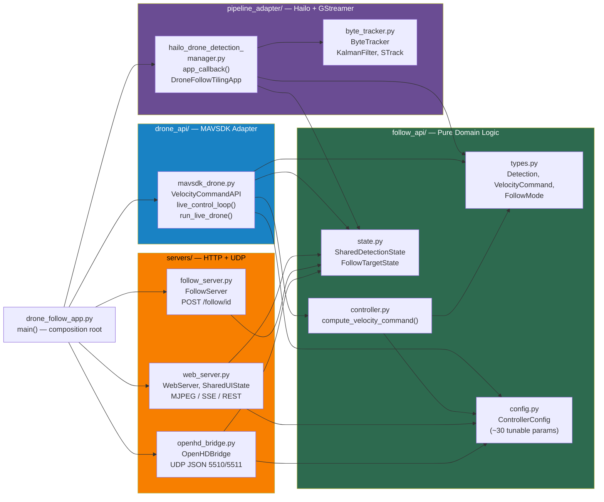

### Dependency Rules

| Layer | May import from | External deps |
|-------|----------------|---------------|
| `follow_api/` | stdlib, numpy | None (pure domain) |
| `pipeline_adapter/` | follow_api, hailo, gi.repository.Gst, numpy, scipy | Hailo SDK, GStreamer |
| `drone_api/` | follow_api, mavsdk | MAVSDK |
| `servers/` | follow_api, stdlib HTTP/socket | None |
| `drone_follow_app.py` | All of the above | — |

**No circular imports.** The dependency graph is a strict DAG with `follow_api/` at the bottom.

---

## 4. Threading Model

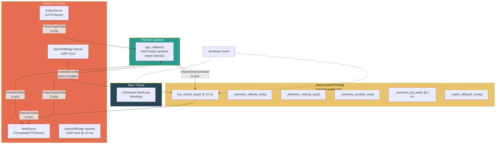

### Synchronization Points

| Shared Object | Type | Writers | Readers |
|--------------|------|---------|---------|
| `SharedDetectionState` | `threading.Lock` | Pipeline callback | Control loop |
| `FollowTargetState` | `threading.Lock` | Web UI, FollowServer, OpenHD bridge | Pipeline callback, control loop |
| `SharedUIState` | `threading.Lock` | Pipeline callback, control loop | Web server (MJPEG/SSE) |
| `ControllerConfig` | Direct field mutation | Web UI, OpenHD bridge | Control loop (reads every tick) |
| `shutdown` | `asyncio.Event` | Main thread (Ctrl+C) | Drone thread, all tasks |

---

## 5. Data Flows

### 5.1 Detection to Velocity Command (main control path)

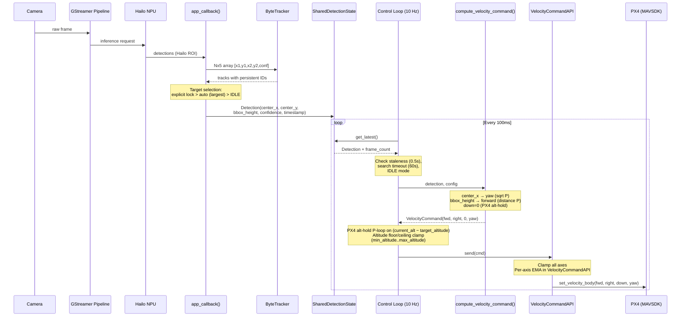

### 5.2 Web UI Real-Time Sync

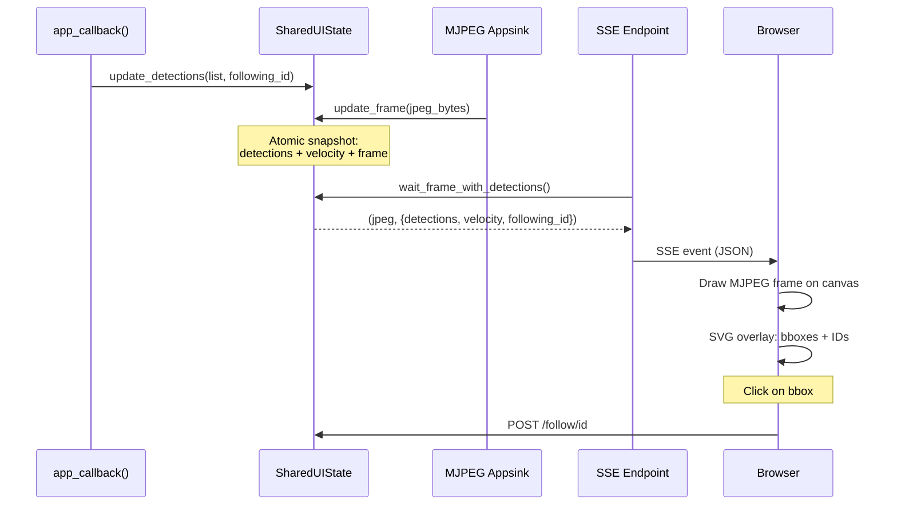

### 5.3 OpenHD Parameter Sync

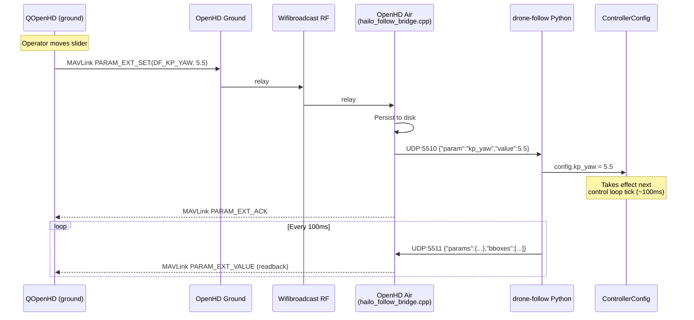

For the full parameter bridge architecture including `df_params.json` schema,
see [PARAMETERS.md](../PARAMETERS.md).

---

## 6. GStreamer Pipeline Topology

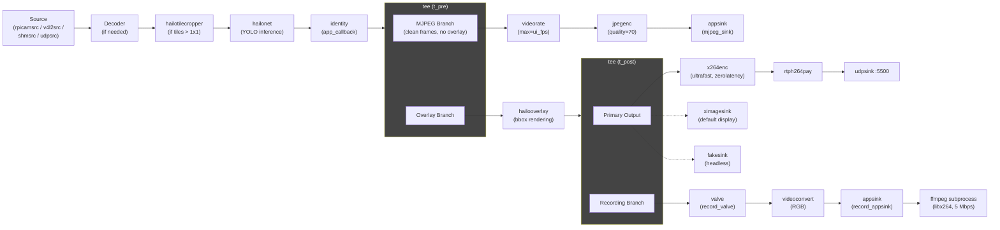

### Primary Output Modes

A single `hailooverlay` sits between `t_pre` and `t_post`, so both the primary output and the recording branch share the same overlay rendering. The MJPEG branch splits off before the overlay (clean frames for web UI SVG overlays).

The primary branch output from `t_post` depends on CLI flags:
- `--openhd-stream`: x264enc + rtph264pay + udpsink (port 5500)
- `--no-display`: fakesink
- default: ximagesink (X11 window)

### Named Elements

| Element | Type | Purpose |
|---------|------|---------|
| `mjpeg_sink` | appsink | Captures JPEG frames for web UI MJPEG stream |
| `record_valve` | valve | Gate for recording branch (drop=true until recording starts) |
| `record_appsink` | appsink | Captures raw RGB for ffmpeg stdin |
| `openhd_stream_encoder` | x264enc | H.264 encode for OpenHD RTP (bitrate live-adjustable) |

### Recording Lifecycle

1. `--record` flag or OpenHD "Record" button calls `start_recording()`
2. Opens `record_valve` (drop=false), spawns ffmpeg subprocess
3. `record_appsink` callback pipes raw RGB frames to ffmpeg stdin
4. `stop_recording()` closes valve, finalizes ffmpeg in background thread
5. Output: `recordings/rec_<timestamp>.mp4` (H.264, 5 Mbps)

---

## 7. External Interfaces

### 7.1 Web UI API (port 5001)

| Method | Endpoint | Purpose |
|--------|----------|---------|
| GET | `/api/video` | MJPEG stream (multipart/x-mixed-replace) |
| GET | `/api/detections/stream` | SSE — frame-synced detections + velocity |
| GET | `/api/detections` | JSON detection snapshot (polling fallback) |
| GET | `/api/status` | Follow status + recording state |
| GET | `/api/config` | Current ControllerConfig as JSON |
| POST | `/api/config` | Update config fields (partial JSON body) |
| POST | `/api/record/start` | Start on-board recording |
| POST | `/api/record/stop` | Stop on-board recording |
| GET | `/api/logs?since_id=N` | Log entries newer than N |
| GET | `/*` | React SPA static files |

### 7.2 Follow Server API (port 8080)

| Method | Endpoint | Purpose |
|--------|----------|---------|
| POST | `/follow/<id>` | Lock to tracking ID |
| POST | `/follow/clear` | Clear lock, auto-follow largest |
| GET | `/status` | Current following state |

### 7.3 OpenHD Bridge (UDP)

| Port | Direction | Format | Purpose |
|------|-----------|--------|---------|
| 5510 | OpenHD to Python | `{"param":"<name>","value":<n>}` | Parameter set |
| 5511 | Python to OpenHD | `{"params":{...},"bboxes":[...]}` | State report (10 Hz) |

### 7.4 MAVSDK / MAVLink

| Interface | Details |
|-----------|---------|
| Setpoint | `VelocityBodyYawspeed` mapped to `SET_POSITION_TARGET_LOCAL_NED` (body frame) |
| Rate | 10 Hz (control loop), 20 Hz (pre-offboard keep-alive) |
| Telemetry | `position()`, `velocity_ned()`, `flight_mode()` streams |
| Actions | `arm()`, `takeoff()`, `land()`, `offboard.start/stop()` |
| Connection | UDP `udpin://0.0.0.0:14540`, serial `/dev/ttyACM0:57600`, TCP `tcpout://host:port` |

### 7.5 Control Output Primitive

```python
@dataclass
class VelocityCommand:
    forward_m_s: float      # +X body (nose)
    down_m_s: float         # +Z body (down positive, NED)
    yawspeed_deg_s: float   # +ve = clockwise from above
```

3-DOF output per control tick. No attitude, no position targets, no thrust.
The MAVSDK 4-tuple's right (+Y body) slot is a literal 0.0 at the boundary —
the orbit-era `right_m_s` field was dropped along with the orbit feature.
`down_m_s` is now vision-driven from `bbox_height` (plain P: person too small →
descend, too big → climb), with floor/ceiling clamping in `live_control_loop`.
See [control-architecture.md](control-architecture.md) for the control math.

---

## 8. Dependencies

### 8.1 System Dependencies

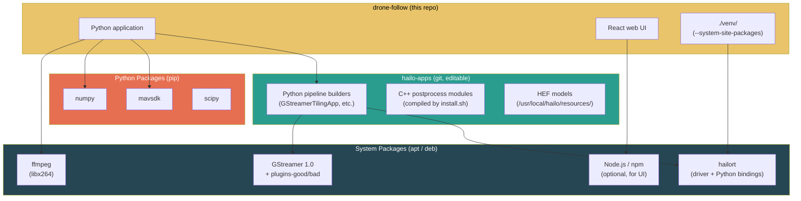

### 8.2 Python Import Boundaries

| Module | External imports |
|--------|-----------------|
| `follow_api/` | stdlib, numpy only |
| `pipeline_adapter/` | `hailo`, `gi.repository.Gst`, `gi.repository.GLib`, numpy, scipy |
| `drone_api/` | `mavsdk` |
| `servers/` | stdlib (`http.server`, `socket`, `json`) |
| `drone_follow_app.py` | All of the above |

### 8.3 Installation Flow

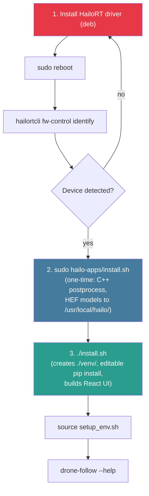

| Step | Scope | Frequency | Requires sudo |
|------|-------|-----------|---------------|
| 1. HailoRT driver | System kernel module + libs | Once per machine | Yes |
| 2. hailo-apps install | `/usr/local/hailo/` (HEFs, C++ .so) | Once per machine | Yes |
| 3. `./install.sh` | `./venv/` (Python + UI) | After each pull | No |
| 4. `source setup_env.sh` | Shell env (venv + PYTHONPATH) | Each terminal session | No |

For detailed setup instructions, see [SETUP_GUIDE.md](../SETUP_GUIDE.md).

---

## 9. Control Modes

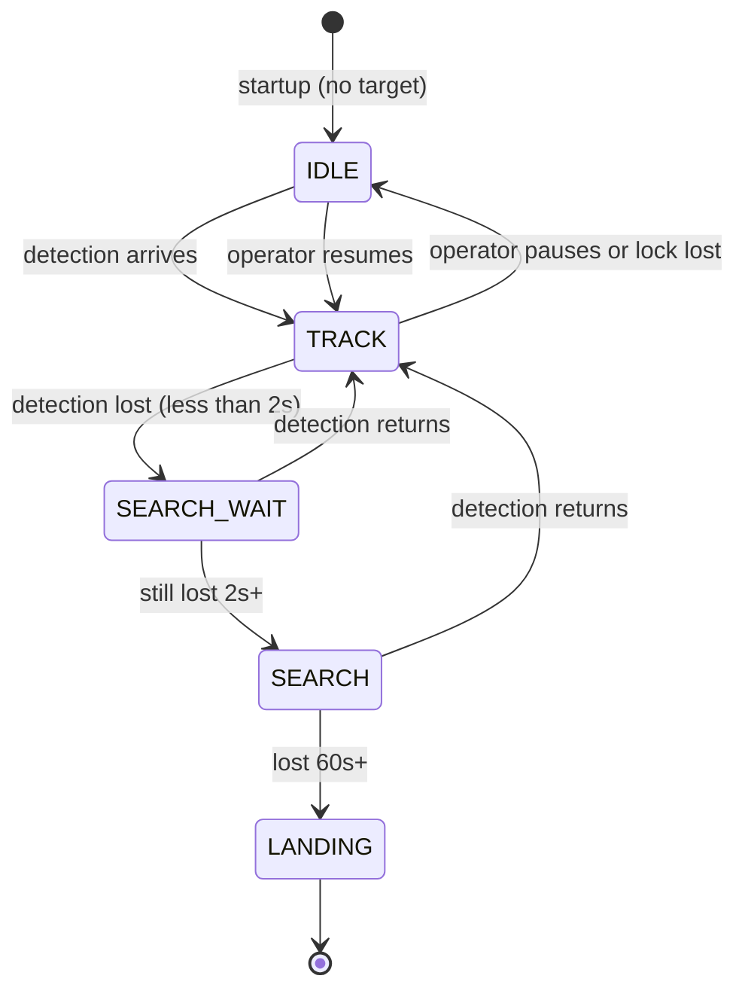

| Mode | Behaviour |
|------|-----------|
| **TRACK** | yaw (center_x → yawspeed) + forward (bbox_height → distance), altitude held by PX4 |
| **SEARCH_WAIT** | Hold last velocity command (< 2s buffer) |
| **SEARCH** | Slow yaw spin (10 deg/s) toward last-seen side, dampened forward |
| **IDLE** | Zero velocity — hover in place |
| **LANDING** | Shutdown then `action.land()` |

For the control math behind each mode, see
[control-architecture.md](control-architecture.md) sections 3-4.

---

## 10. Safety Features

| Feature | Trigger | Response |
|---------|---------|----------|
| Emergency climb + reverse | `bbox_height > 0.8` | Max climb (`-max_climb_speed`) + full reverse (`-max_backward`) |
| Search timeout | No detection for 60s | Land |
| Explicit lock loss | Locked target disappears | IDLE (hover), not auto-switch |
| Offboard mode loss | Pilot switches out of OFFBOARD | Pause control, wait for re-entry |
| Landing protection | Ctrl+C during `action.land()` | SIGINT ignored until touchdown |
| Altitude limits | Always active | Floor/ceiling clamp at `min_altitude`..`max_altitude` (default 2--20 m) |
| Axis clamping | Every tick | All axes clamped to configured max speeds |

---

## 11. Boot and Deployment

### RPi Air Unit Boot Sequence

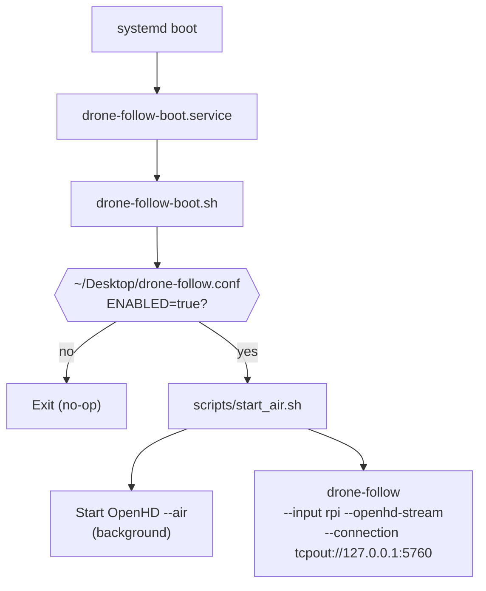

### Execution Modes

| Mode | Command | Use case |
|------|---------|----------|
| Real drone + OpenHD | `scripts/start_air.sh` | Flight (RPi air unit) |
| Dev machine + USB camera | `drone-follow --input usb --serial --ui` | Bench testing |
| Simulation | `sim/start_sim.sh` + `drone-follow --input udp://... --takeoff-landing --ui` | Development |
| Headless OpenHD | `drone-follow --input rpi --openhd-stream --no-display` | SSH sessions |

---

## 12. Key Files Reference

| File | Lines | Purpose |
|------|-------|---------|
| `drone_follow/drone_follow_app.py` | ~270 | Composition root, CLI, threading |
| `drone_follow/follow_api/types.py` | ~35 | Domain primitives |
| `drone_follow/follow_api/config.py` | ~230 | ControllerConfig (all parameters) |
| `drone_follow/follow_api/controller.py` | ~170 | Pure control math |
| `drone_follow/follow_api/state.py` | ~100 | Thread-safe shared state |
| `drone_follow/drone_api/mavsdk_drone.py` | ~780 | MAVSDK adapter, control loop, flight lifecycle |
| `drone_follow/pipeline_adapter/hailo_drone_detection_manager.py` | ~820 | GStreamer pipeline, detection callback |
| `drone_follow/pipeline_adapter/byte_tracker.py` | ~500 | Multi-object tracker |
| `drone_follow/servers/web_server.py` | ~440 | Web UI server |
| `drone_follow/servers/follow_server.py` | ~130 | REST target selection |
| `drone_follow/servers/openhd_bridge.py` | ~370 | OpenHD parameter bridge |
| `drone_follow/ui/src/App.jsx` | ~600 | React frontend |

---

## 13. Related Documentation

| Document | Covers |
|----------|--------|
| [control-architecture.md](control-architecture.md) | Control math, parameter tuning guide, algorithm details |
| [PARAMETERS.md](../PARAMETERS.md) | OpenHD parameter bridge, df_params.json schema |
| [SETUP_GUIDE.md](../SETUP_GUIDE.md) | End-to-end deployment with OpenHD |
| [README.md](../README.md) | Installation, CLI flags, quick start |
| [TROUBLESHOOTING.md](../TROUBLESHOOTING.md) | Common issues and fixes |
