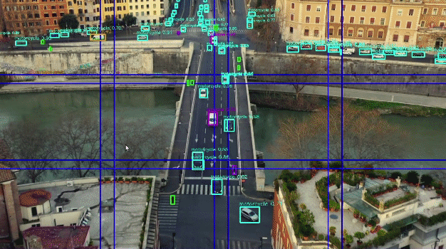

# Tiling Application



## Overview

The tiling pipeline demonstrates splitting each frame into several tiles which are processed independently by the `hailonet` element. This method is especially effective for **detecting small objects in high-resolution frames**.

**To demonstrate tiling capabilities, we've selected a drone/aerial use case as the default:**
- **Default Model:** VisDrone MobileNetSSD (300×300) - optimized for aerial object detection
- **Default Video:** `tiling_visdrone_720p.mp4` - aerial footage with small objects
- **Use Case:** Perfect for demonstrating small object detection in high-resolution frames

For general object detection scenarios, use the `--general-detection` flag to switch to YOLO with COCO dataset.


## Usage Examples
**Note its very easy to reach a very high fps requirements by using too many tiles.**
If you application seems to be slow, try to use less tiles. If you do need to use more tiles, you can reduce the frame rate using the `--frame-rate` flag.

### Basic Examples

**Default (VisDrone aerial detection):**
```bash
hailo-tiling
```
To close the application, press `Ctrl+C`.

- Uses VisDrone MobileNetSSD (300×300) + VisDrone video
- Perfect for demonstrating small object detection

**General detection mode (common use cases):**
```bash
hailo-tiling --general-detection
```
- Uses YOLO (640×640) + COCO dataset + multi-scale
- Uses standard detection video (`example.mp4`)
- Optimized for general object detection

**With live camera:**
```bash
hailo-tiling --input rpi --general-detection
```
- Uses YOLO (640×640) + COCO dataset + multi-scale

**Manual tile grid:**
```bash
hailo-tiling --input usb --tiles-x 3 --tiles-y 2 --hef /path/to/hef_file.hef
```
- Uses USB camera
- Creates exactly 3×2 = 6 tiles
- Uses custom HEF file (a stronger yolo for example)

## How Tiling Works

### Single-Scale Tiling (Default)
In single-scale mode, each frame is divided into a grid of tiles. Each tile is:
- Sized to match the model's input resolution
- Processed independently through the detection model
- Results are aggregated and filtered using NMS to remove duplicates

**Benefits:**
- Maintains high detection accuracy for small objects
- No downscaling of the original image
- Efficient processing of high-resolution frames

### Multi-Scale Tiling (Advanced)
Multi-scale mode is useful when your scene contains objects of varying sizes. It **adds predefined tile grids** on top of your custom tile configuration.

**How it works:** Multi-scale mode processes BOTH:
1. **Your custom tile grid** (auto-calculated or manually specified)
2. **Additional predefined grids** based on scale-level

Multi-scale adds these predefined grids:
- **scale-level 1**: Adds full image (1×1) = +1 tile
- **scale-level 2**: Adds 1×1 + 2×2 = +5 tiles
- **scale-level 3**: Adds 1×1 + 2×2 + 3×3 = +14 tiles

**Example:** With auto mode (2×2 custom grid) and `--multi-scale --scale-levels 2`:
- Custom tiles: 2×2 = 4 tiles
- Additional: 1×1 + 2×2 = 5 tiles
- **Total: 9 tiles per frame**

The pipeline performs: Crop → Inference → Post-process → Aggregate → Remove border objects → Perform NMS

## Understanding Overlap

**Overlap** is the percentage of tile area that overlaps with adjacent tiles. It's automatically calculated to ensure:
1. Full coverage of the input frame
2. Objects on tile boundaries are detected reliably

### Why Overlap Matters
- Objects that fall exactly on tile boundaries might be cut in half
- Each half might be too small to be detected reliably
- **Critical Rule:** Overlap should be ≥ the pixel size of your **smallest object** you need to detect

### Setting Minimum Overlap

Use the `--min-overlap` parameter to ensure sufficient overlap for your objects:

**Formula:** `min-overlap ≥ smallest_object_size / model_input_size`

**Examples for 640×640 model:**
- Detecting 32px objects: `--min-overlap 0.05` (32/640 = 0.05 = 5%)
- Detecting 64px objects: `--min-overlap 0.10` (64/640 = 0.10 = 10%, **default**)

### How It Works

1. **Auto Mode:** The application calculates the number of tiles needed to ensure at least `min-overlap` between adjacent tiles
2. **Manual Mode:** If you specify tile counts that result in less than `min-overlap`, the tiles will be enlarged to meet the minimum overlap. And you'll receive a warning

### Overlap Recommendations


**Important:** Setting `--min-overlap` ensures the application creates enough tiles to maintain the specified overlap. A higher minimum overlap means:
- More tiles will be generated
- Better coverage of objects on boundaries
- Higher computational cost (more tiles to process)

**Note:** The actual overlap may be higher than the minimum if needed for full frame coverage.

## Why Use Native Resolution Tiles (No Upscaling)

To ensure maximum detection performance, particularly for small objects, all tiled inputs must meet or exceed the model's trained resolution.

### The Critical Issue: Data Fidelity

**Loss of Detail:** When you slice the original image into smaller tiles and then upsample them back to the original size, you are not adding information. The interpolation process (like bilinear or bicubic resizing) introduces smoothing and artifacts, effectively blurring the fine details that the model relies on to distinguish small objects from the background.

**Training Mismatch:** The model was trained on high-quality, native-resolution data. Feeding it synthetically upscaled, degraded inputs creates a distribution shift between the training and inference data, leading to an immediate and significant drop in Mean Average Precision (mAP) and overall detection reliability.

**Feature Integrity:** The early layers of the convolutional neural network (CNN) are responsible for extracting low-level features (edges, corners). These features are severely compromised by the upscaling artifacts, hindering the entire detection pipeline.

**Actionable Rule:** Always tile your large image into chunks that are the model's input size or larger, and then crop/resize down to the model's input size if necessary, but never resize a sub-native tile up to match the required input size.

### How This Application Handles It

This tiling application automatically ensures that:
- Each tile is **exactly the model's input size**
- **No upscaling occurs** - tiles are always at or above native resolution
- The original image is **never downscaled** before tiling
- Overlap between tiles compensates for boundary effects without degrading quality

This approach maintains the full fidelity of your input data, ensuring optimal detection accuracy.

## Command-Line Arguments

### Model Options

*   `--hef-path` - Path to custom YOLO HEF model file (auto-selected based on architecture if not specified)

**Automatic Detection:**
The pipeline automatically detects everything from the HEF filename:
- **MobileNetSSD models** (containing 'mobilenet') → 300×300 input, MobileNetSSD post-processing
- **All other models** → 640×640 input, YOLO post-processing

**Default Model:**
- Uses VisDrone MobileNetSSD (300×300) as the default when no HEF is specified

**Default Video:**
- Uses `tiling_visdrone_720p.mp4` as the default when no input is specified

**General Detection Mode:**
- Use `--general-detection` flag for common use cases
- Switches to YOLO model (640×640) with COCO dataset
- Uses standard detection video (`example.mp4`) as default
- Automatically enables multi-scale for better object detection
- Optimized for general object detection scenarios

### Tiling Options

The application operates in two modes:

**Auto Mode (Default):** Automatically calculates optimal tile grid based on model size
- Tiles are sized to `model-input-size × model-input-size`
- Grid is calculated to cover the entire frame
- Overlap is automatically adjusted for full coverage

**Manual Mode:** Activated when you specify `--tiles-x` or `--tiles-y`
- You control the tile grid dimensions
- Tiles sized to model input resolution (or larger if needed for minimum overlap)
- Tiles always maintain square aspect ratio (width = height)
- Overlap automatically calculated to ensure coverage
- **Note:** If minimum overlap can't be met with model input size, tiles will be enlarged while maintaining square aspect ratio

*   `--tiles-x` - Number of tiles horizontally (triggers manual mode)
*   `--tiles-y` - Number of tiles vertically (triggers manual mode)
*   `--min-overlap` - Minimum overlap ratio between tiles (default: 0.1 = 10%)
    - Should be ≥ (smallest_object_size / model_input_size)
    - Example: For 64px objects with 640px model: `--min-overlap 0.10`
    - Higher values create more tiles for better object coverage

**Note:** You can specify just `--tiles-x` or just `--tiles-y`, and the other dimension will be auto-calculated.

### Multi-Scale Options

**Note:** Multi-scale mode ADDS predefined grids to your custom tiles (does not replace them)

*   `--multi-scale` - Enable multi-scale tiling (adds predefined grids to custom tiles)
*   `--scale-levels` - Which predefined grids to add (default: 1, range: 1-3)
    - `1`: Adds full image (1×1) = +1 tile
    - `2`: Adds 1×1 + 2×2 = +5 tiles
    - `3`: Adds 1×1 + 2×2 + 3×3 = +14 tiles

### Detection Options

*   `--general-detection` - Use YOLO model with multi-scale for general object detection (COCO dataset)
*   `--iou-threshold` - NMS IOU threshold for filtering overlapping detections (default: 0.3)
*   `--border-threshold` - Border threshold to remove tile edge detections in multi-scale mode (default: 0.15)

## Configuration Output

When you run the application, it displays a detailed configuration summary:

```
======================================================================
TILING CONFIGURATION
======================================================================
Input Resolution:     1280x720
Model:                yolov6n.hef (YOLO, 640x640)

Tiling Mode:          AUTO
Custom Tile Grid:     2x2 = 4 tiles
Tile Size:            640x640 pixels

Multi-Scale:          ENABLED (auto-enabled for general detection)
  Custom Tiles:       2x2 = 4 tiles
  Additional Grids:   1x1 = 1 tile
  Total Tiles:        5

Detection Parameters:
  Batch Size:         5
  IOU Threshold:      0.3
  Border Threshold:   0.15

Model:               YOLO (general detection mode) (640x640)

Overlap:              X: 0.0% (~0px), Y: 15.6% (~100px)
  ⚠️  Warning:         Very small overlap may miss objects on boundaries
======================================================================
```

This helps you understand:
- What tile configuration is being used
- Whether overlap is sufficient for your use case
- Total number of tiles being processed per frame

## Performance Considerations

**Batch Size:**
- The batch size is automatically set to match the total number of tiles
- Single-scale with 2×2 grid → batch size = 4
- Single-scale with 4×3 grid → batch size = 12
- Multi-scale (2×2 custom) + scale-levels 1 → batch size = 4 + 1 = 5
- Multi-scale (2×2 custom) + scale-levels 2 → batch size = 4 + 5 = 9
- Multi-scale (2×2 custom) + scale-levels 3 → batch size = 4 + 14 = 18
- This ensures optimal processing throughput

**Single-Scale Mode:**
- Lower to moderate computational cost (depends on tile grid)
- Customizable tile grid (1-20 tiles per axis)
- Best for scenes with uniform object sizes or when you need specific tile coverage
- Examples:
  - 2×2 grid = 4 tiles per frame
  - 4×3 grid = 12 tiles per frame
  - 6×4 grid = 24 tiles per frame

**Multi-Scale Mode:**
- Adds predefined grids (1×1, 2×2, 3×3) to custom tiles
- Higher computational cost (processes custom + predefined grids)
- Best for scenes with varied object sizes
- Custom tile settings are still used and important
- Examples (with 2×2 custom grid):
  - scale-levels 1: 4 + 1 = 5 tiles per frame
  - scale-levels 2: 4 + 5 = 9 tiles per frame
  - scale-levels 3: 4 + 14 = 18 tiles per frame

**Tile Count Impact:**
- More tiles = better small object detection
- More tiles = higher processing time (scales with batch size)
- Balance based on your hardware and requirements
- Batch processing helps optimize throughput

**Experiment:** Try different tile counts and overlap values to find the best balance for your use case. The "auto mode" is a good starting point but probably an overkill for your use case. Note that you might get better results by using less tiles and a stronger model.


### All pipeline commands support these common arguments:

[Common arguments](../../../../doc/user_guide/running_applications.md#command-line-argument-reference)