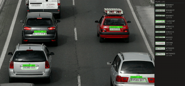

# Hailo LPR Application



#### Run the LPR example:
```bash
hailo-lpr
```
To close the application, press `Ctrl+C`.

This example demonstrates real-time license-plate recognition using a single
4-class yolov8n detector for plate localisation paired with a locally
retrained 37-class LPRNet OCR head. A multilingual `paddle_ocr_v5`
alternative is available via `--ocr paddle`.

#### Running with Raspberry Pi Camera input:
```bash
hailo-lpr --input rpi
```

#### Running with USB camera input (webcam):
There are 2 ways:

Specify the argument `--input` to `usb`:
```bash
hailo-lpr --input usb
```

This will automatically detect the available USB camera (if multiple are connected, it will use the first detected).

Second way:

Detect the available camera using this script:
```bash
get-usb-camera
```
Run example using USB camera input - Use the device found by the previous script:
```bash
hailo-lpr --input /dev/video<X>
```

For additional options, execute:
```bash
hailo-lpr --help
```

#### Running as Python script

For examples:
```bash
python lpr.py --input usb
```

#### App logic

The LPR pipeline operates in two stages:

1. **Plate Detection Stage**: A 4-class yolov8n_384_640 detector
   (person / vehicle / face / license_plate) runs once per frame. Only
   detections labelled `license_plate` are kept and forwarded.

2. **OCR Stage**: Each plate crop is resized and fed to the selected OCR
   network (`lprnet` or `paddle`). The decoded text passes a length gate
   and an engine-specific confidence gate before being printed and added
   to the on-screen plate log.

A `hailo_tracker` between the two stages assigns a stable `track_id` to
each plate so the OCR network only runs once per unique plate, not once
per frame. Quality gates (sharpness, crop size, ROI) filter detections
before they reach OCR.

#### Working in Python with the results

The basic idea is to utilize the pipeline's callback function. In simple terms, it can be thought of as a Python function that is invoked at the end of the pipeline when frame processing is complete.

This is the recommended location to implement your logic.

```python
def app_callback(element, buffer, user_data):
    roi = hailo.get_roi_from_buffer(buffer)
    for det in roi.get_objects_typed(hailo.HAILO_DETECTION):
        if det.get_label() != "license_plate":
            continue
        track_id = det.get_objects_typed(hailo.HAILO_UNIQUE_ID)[0].get_id()
        # crop, OCR, gate, log...
    return
```

The `user_app_callback_class` extends the base callback class with
LPR-specific state:
- `seen_plates`: `track_id → plate_text` for plates already accepted
- `plate_log`: recent `(crop, text, confidence, track_id)` tuples for
  the display panel
- `ocr_infer`: the HailoRT OCR inference handle

#### Backbones

| Backbone            | Detection chain | Typical use |
|---------------------|-----------------|-------------|
| `yolov8n` (default) | one `hailo_yolov8n_384_640` (4 classes: person / vehicle / face / license_plate) | most workloads |
| `yolov8n_tiled`     | same network, fed 5 tiles per frame (2×2 quadrants + 1 full frame), aggregated | FHD / 4K input where small plates need higher per-plate pixel density |

`yolov8n` is light-weight enough to run on H8L while reading plates
end-to-end in real time. `yolov8n_tiled` trades ~30 % FPS for a
meaningful accuracy lift on HD-and-up source video; opt-in when needed.

#### OCR engines

`lprnet` (default) is a locally-retrained 37-class Latin-alphanumeric
LPRNet (`lprnet_intl.hef`). Distinct filename from the bundled 11-class
`lprnet.hef` so the two coexist on disk. Confidence threshold: 0.50.

`paddle` is `paddle_ocr_v5_mobile_recognition`. 18,385-class CTC head,
broader script support, more tolerant of formatting. Lower per-character
confidence by design; threshold: 0.30.

#### Operational thresholds

| Component       | Threshold | Effect                                                                |
|-----------------|----------:|-----------------------------------------------------------------------|
| Detector score  | **0.25**  | Plates with detection score ≥ 0.25 are forwarded to OCR               |
| OCR (`lprnet`)  | **0.50**  | OCR reads with per-character softmax mean ≥ 0.50 are accepted         |
| OCR (`paddle`)  | 0.30      | Paddle softmax is spread over 18 k classes — lower gate by design     |

#### Accuracy

Default configuration (`--backbone yolov8n_tiled --ocr lprnet`),
performance-compiled HEFs. Detector and OCR are reported separately.

Detector — `yolov8n_384_640` (license_plate class, score ≥ 0.25, IoU ≥ 0.5):

| Device       | GT plates | Recall    | Miss     | Precision | mean IoU | FPS  |
|--------------|----------:|----------:|---------:|----------:|---------:|-----:|
| Hailo-8      | 5,014     | 98.4 %    | 1.6 %    | 99.2 %    | 0.854    | 120  |
| Hailo-10H    | 5,014     | 98.9 %    | 1.1 %    | 99.3 %    | 0.855    | 80   |

OCR — 37-class `lprnet_intl.hef` on real labeled plate crops:

| Region group                | N    | H8 EXACT | H10H EXACT | ≤d2 (H8) | char-acc (H8) |
|-----------------------------|-----:|---------:|-----------:|---------:|--------------:|
| US *(real)*                 |  148 | 97.3 %   | 96.6 %     | 100.0 %  | 99.4 %        |
| EU *(real)*                 |   22 | 95.5 %   | 95.5 %     | 100.0 %  | 99.4 %        |
| Rest of world *(IL synth.)* |  996 | 78.2 %   | 78.2 %     | 96.3 %   | 95.0 %        |

Most remaining misses are 1–2 character substitutions on visually-similar
pairs (`I`↔`1`, `O`↔`0`, `S`↔`5`, `B`↔`8`).

#### Performance on the accelerator

End-to-end wall-clock FPS of the full GStreamer pipeline (OCR = `lprnet`),
performance-compiled HEFs:

| Backbone (OCR = lprnet)     | Hailo-8 | Hailo-8L\* | Hailo-10H | Notes                                        |
|-----------------------------|--------:|-----------:|----------:|----------------------------------------------|
| `yolov8n`                   | ~254    | ~117       | ~243      | Single inference per frame, real-time on FHD |
| `yolov8n_tiled` *(default)* | ~171    | ~77        | ~80       | 5-tile inference; best accuracy on FHD / 4K  |

\* H8L FPS measured by running the H8L performance HEFs on a physical H8
device (H8 is a strict superset of H8L; HEFs compiled for H8L run on H8
unchanged). Faithful proxy for actual H8L throughput, within ±5 % of
the expected ~0.5× of H8.

#### Honest limitations

- Detector miss rate is ~1 % on the real plate-detection corpus; OCR
  miss rate on real US/EU plates is ~3–5 %. Most remaining failures come
  from motion blur, severe perspective, or partially-occluded plates.
- Numeric-only plate formats are a weak spot. The 37-class LPRNet has
  no format prior, so digit-only plates (e.g. IL) tend to pick up
  spurious letter substitutions.
- The 37-class LPRNet is trained on Latin alphanumerics only. Plates
  with non-Latin script (Arabic, Cyrillic, CJK) need `--ocr paddle`.

#### Fine-tuning LPRNet for your regional plates

The shipped 37-class LPRNet is trained on a mixed Latin corpus, so a
single-region deployment inherits a generality cost it doesn't need to
pay. Retraining the OCR head on a narrower corpus closes most of the
remaining gap between near-match and exact-match in that region.

LPRNet is small, the architecture ships unchanged, and a few thousand
labeled plate crops from the target region is enough to move the
needle. Fine-tune from the checkpoint, recompile, and drop the new HEF
in at `/usr/local/hailo/resources/models/<arch>/lprnet_intl.hef`. No
pipeline changes needed.

#### Installation

A plain `sudo ./install.sh` fetches everything the OOB LPR path needs
for the detected architecture:

```
/usr/local/hailo/resources/models/<arch>/
├── hailo_yolov8n_384_640.hef    # default backbone
├── lprnet_intl.hef              # default OCR (retrained 37-class)
├── paddle_ocr_v5.hef            # paddle OCR v5 mobile recognition (LPR-app build)
├── ppocrv5_char_dict.npz        # paddle v5 character dictionary (sidecar)
├── ocr.hef                      # legacy paddle OCR v3/v4 (standalone paddle_ocr)
└── ocr_det.hef                  # paddle text detector
```

`lprnet_intl`, `hailo_yolov8n_384_640`, and `paddle_ocr_v5` are listed
under `lpr → default` in
[`resources_config.yaml`](../../../config/resources_config.yaml) and
fetched from the `LPR/` subdirectory on S3.

If you've compiled a fresh `lprnet_intl.hef` locally and want to test it
before it's published to S3, drop it in place manually:

```bash
sudo cp /path/to/your/lprnet_intl.hef \
        /usr/local/hailo/resources/models/<arch>/lprnet_intl.hef
```

## Command Line Arguments

### Application specific arguments:
```bash
--backbone <name>       # yolov8n (default) | yolov8n_tiled
--ocr <name>            # lprnet (default) | paddle
--save-ocr-inputs [dir] # Dump every OCR-network input crop (default: /tmp/lpr_ocr_inputs)
```

### Run examples:
```bash
# Default — yolov8n backbone + retrained LPRNet
hailo-lpr

# Best accuracy on HD / 4K
hailo-lpr --backbone yolov8n_tiled --ocr lprnet --input <your-clip.mp4>

# Multilingual OCR
hailo-lpr --backbone yolov8n_tiled --ocr paddle --input <your-clip.mp4>
```

### All pipeline commands support these common arguments:

[Common arguments](../../../../doc/user_guide/running_applications.md#command-line-argument-reference)
