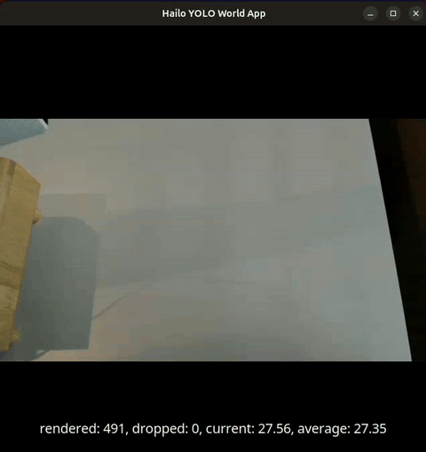

# YOLO World Application



Open-vocabulary, zero-shot object detection: detect **anything you describe in text** — no retraining, classes changeable at runtime. Supported on **Hailo-8** and **Hailo-10H**; the `yolo_world_v2s` HEF is dual-input either way (image + 80×512 text embeddings).

#### Run the YOLO World example:
```bash
hailo-yolo-world
```
To close the application, press `Ctrl+C`.

By default it detects the COCO-80 classes. Provide your own classes with `--prompts`:
```bash
hailo-yolo-world --prompts "person, water glass, houseplant"
```

#### Running with Raspberry Pi Camera input:
```bash
hailo-yolo-world --input rpi
```

#### Running with USB camera input (webcam):
There are 2 ways:

Specify the argument `--input` to `usb`:
```bash
hailo-yolo-world --input usb
```
This will automatically detect the available USB camera (if multiple are connected, it will use the first detected).

Second way — detect the available camera, then pass the device:
```bash
get-usb-camera
hailo-yolo-world --input /dev/video<X>
```

For additional options, execute:
```bash
hailo-yolo-world --help
```

#### Running as Python script

```bash
python yolo_world.py --input usb --prompts "person, dog, laptop"
```

#### App logic

You supply free-text class names; a CLIP text encoder turns them into embeddings that the `yolo_world_v2s` HEF uses to score every region. The "business logic" lives in Python's `app_callback`: it runs the dual-input HEF (image + text embeddings), decodes the raw tensors (DFL + per-class NMS), stabilizes detections across frames, and attaches them as `hailo.HailoDetection` metadata for `hailooverlay` to draw.

The `YoloWorldCallbackData` class shares state (inference engine, embedding manager, detection stabilizer) with the pipeline class `GStreamerYoloWorldApp`.

#### Prompts

- Pass `--prompts "a, b, c"` or `--prompts-file classes.json` (a JSON array of up to 80 class names).
- Embeddings are cached to `embeddings.json` and re-encoded automatically when the prompts file changes (`--watch-prompts`).

##### Prompt phrasing matters

Open-vocabulary detection is very sensitive to phrasing — small word changes can move detection quality from rock-solid to near-zero. Two rules of thumb:

- **Use concrete nouns the model was trained on.** Out-of-distribution phrasings ("fidget toy", "leafy plant", "flower pot") often score ~0 and the model can latch onto the nearest in-vocab class instead, producing confident *false* labels ("fire hydrant" on a colorful object). The default COCO-80 set works for canonical objects in normal scenes; for anything else, try the LVIS / Objects365 category space.
- **Iterate on synonyms when a class detects weakly.** "potted plant" peaked at 0.25 in one office scene while "houseplant" / "indoor plant" peaked at 0.95 in the same frames. Run `hailo-yolo-world --interactive` and use `?word` in the panel to rank near-synonyms by what *actually* detects on recent frames — that's the fastest path to a stable prompt.

#### Interactive mode

```bash
hailo-yolo-world --input usb --prompts "person" --interactive
```
A terminal panel lets you change classes live: type names to **replace**, `+name` to **add**, `-name` to **remove**, and `?name` to get a **"did you mean"** suggestion ranked by how strongly each phrasing actually detects.

#### Text encoder

Text embeddings are produced by a pure-NumPy CLIP ViT-B/32 encoder (numerically identical to HuggingFace `openai/clip-vit-base-patch32`), so the app needs **no `torch`/`transformers`** at runtime — only `numpy` + `tokenizers`. The encoder body weights (`clip_text_vitb32_body_fp16.npz`) are a downloaded resource; regenerate them offline with `extract_clip_text_weights.py`.

#### Resolution

The pipeline runs the detector at 640×640. Source resolution can be set via:
```bash
self.video_width
self.video_height
```

#### Running with different models

See our [hailo_model_zoo](https://github.com/hailo-ai/hailo_model_zoo) for additional supported models.

By default, the package contains a single model depending on the device architecture.
You can download additional models by running `hailo-download-resources --all`.
The models are downloaded to the `resources/models/` directory.

#### HEF provenance (frozen)

All three HEFs are pinned in the cs-data S3 bucket — none are pulled from the
model zoo at runtime. This insulates the app from upstream changes that could
alter output layout, NMS config, or input quantization. To re-pin, overwrite the
staged file under `s3_staging/hefs/<arch>/` and update the row below.

| Arch | HEF | Source of truth | md5 | Compile notes |
|---|---|---|---|---|
| `hailo8` | `yolo_world_v2s.hef` (25.3 MB) | DFC 3.33 recompile from the quantized HAR, `performance_param(compiler_optimization_level=max)` | `0aade2deae4e11cb319464a280ff4e9d` | 3 contexts, a16w16 on concat/conv_feature_splitter + selected convs |
| `hailo8l` | `yolo_world_v2s.hef` (41.2 MB) | Same flow as H8 above, target arch `hailo8l` | `03a5832b668bc2fa5cade0dddaa63bb1` | 4 contexts, a8w8 throughout (H8L resource budget) |
| `hailo10h` | `yolo_world_v2s.hef` (27.6 MB) | Frozen from Hailo model-zoo **v5.3.0** | `228559cbb1adb253a5f19b86d1536841` | Raw-tensor output (6 heads), DFL + NMS in Python postprocess |

#### Retrained Networks Support
YOLO World is published for fine-tuning (normal / prompt-tuning / reparameterized). For reliable detection of a fixed class set, fine-tune in the [AILab-CVC/YOLO-World](https://github.com/AILab-CVC/YOLO-World) framework and recompile to a HEF. For more information, see [Using Retrained Models](../../../../doc/developer_guide/retraining_example.md).

## Command Line Arguments

### Application specific arguments:
```bash
--prompts <str>              # Comma-separated class names, e.g. "cat,dog,person"
--prompts-file <path>        # Path to a JSON array of class names (max 80)
--embeddings-file <path>     # Path to cached embeddings JSON
--confidence-threshold <f>   # Detection confidence threshold (default 0.3)
--watch-prompts              # Reload the prompts file on change
--interactive                # Live prompt control panel in the terminal
```

### All pipeline commands support these common arguments:

[Common arguments](../../../../doc/user_guide/running_applications.md#command-line-argument-reference)
